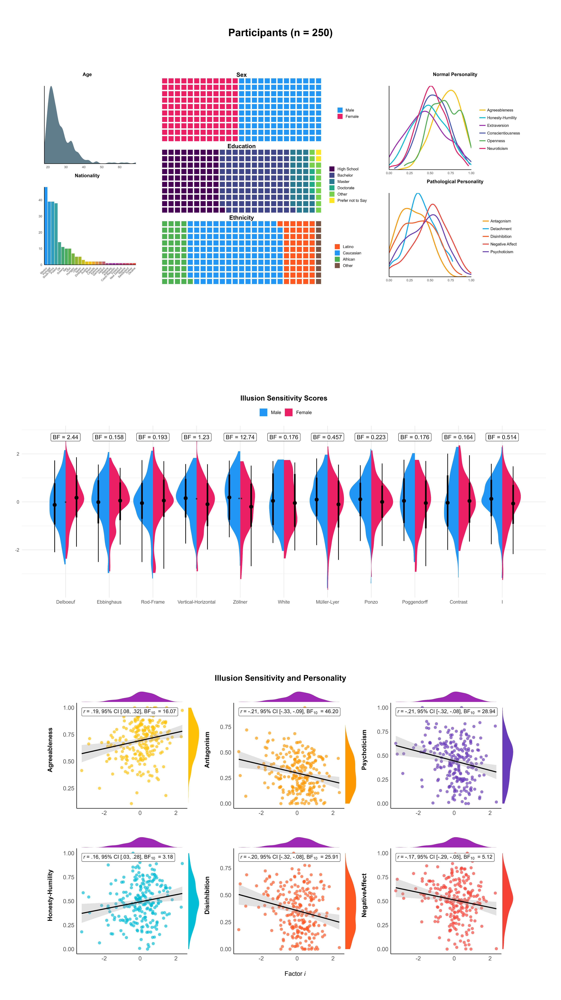

# The Illusion Game Validation Study

*Dominique Makowski, An Shu Te, Stephanie Kirk, Ngoi Zi Liang, & S.H. Annabel Chen*

**Abstract.** Visual illusions highlight how the brain uses contextual and prior information to inform our perception of reality. Unfortunately, illusion research has been hampered by the difficulty of adapting these stimuli to experimental settings. In this study, we used the novel parametric framework for visual illusions to generate 10 different classic illusions (Delboeuf, Ebbinghaus, Rod and Frame, Vertical-Horizontal, Zöllner, White, Müller-Lyer, Ponzo, Poggendorff, Contrast) varying in strength, embedded in a perceptual discrimination task. We tested the objective effect of the illusions on errors and reaction times, and extracted participant-level performance scores (n=250). Our results provide evidence in favour of a general factor (labelled Factor *i*) underlying the sensitivity to different illusions. Moreover, we report a positive relationship between illusion sensitivity and personality traits such as Agreeableness, Honesty-Humility, and negative relationships with Psychoticism, Antagonism, Disinhibition, and Negative Affect.

<!-- - [**Study 0**](https://realitybending.github.io/IllusionGameValidation/study0/index.html): Study 0 refers to an un-analyzed pilot of the perceptual task without the illusion (only the targets). -->
- [**Pilot**](https://realitybending.github.io/IllusionGameValidation/study1/index.html): The pilot study of the illusions that let to the refinement of the parameters of the illusions and the fixing of bugs in the illusion-generating software.
- [**Experiment**](https://realitybending.github.io/IllusionGameValidation/study2/index.html): Try the final experiment.

## See Results

- [**Pilot**](https://realitybending.github.io/IllusionGameValidation/study1/study1.html): In which we have a first look at the effects and refine the stimuli selection.
- [**Study (part 1)**](https://realitybending.github.io/IllusionGameValidation/study2/study2.html): In which we analyze the effect of illusion strength and task difficulty on errors and RT.
- [**Study (part 2)**](https://realitybending.github.io/IllusionGameValidation/study3/study3.html): In which we analyze the links with personality.

## Download Data

- [**Raw data** (part 1)](data/study2_part1.csv): Can be assembled with `rbind(read.csv("study2_part1.csv"), read.csv("study2_part2.csv"))`
- [**Raw data** (part 2)](data/study2_part2.csv)
- [**Participant-level data**](data/study3.csv)

## Other

- IRB-2022-187 from NTU
- [**Preregistration**](https://osf.io/5d6xp)
- [**Pyllusion Software**](https://github.com/RealityBending/Pyllusion)

